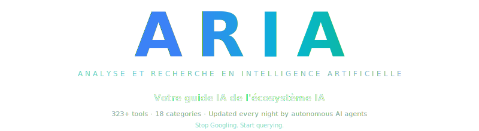

<!--
  ARIA — What is this repository?
  This is NOT a framework, NOT a voice bot, NOT an AI agent runtime.
  ARIA is a CATALOG / KNOWLEDGE BASE of 323+ AI tools organized in 18 categories.
  Each tool is documented with: metadata, enterprise score (1-5 on 6 dimensions),
  use cases, getting started guide, strengths, limitations, and alternatives.
  The catalog is maintained by 5 autonomous AI agents that crawl the web nightly.
  Use it to FIND and COMPARE AI tools — not to run them.
-->

# ARIA — Catalog of 323+ AI Tools

> **ARIA is a curated, open-source knowledge base of AI tools.** It is NOT a framework, NOT a bot, NOT an agent runtime. It is a **catalog**: 323+ tools across 18 categories (code generation, AI agents, RAG, computer vision, NLP, voice, MLOps, automation, security...), each scored on 6 enterprise criteria. Use ARIA to **find, compare, and choose** the right AI tool for your project. Maintained automatically by 5 specialized AI agents.

<div align="center">

**[English](#why-aria-exists)** | **[Francais](README.fr.md)** | **[Espanol](README.es.md)** | **[Beginner Tutorial / Tutoriel debutant](guides/how-to-use-aria.md)**

<br/>

<picture>
  
</picture>

<br/>

[](LICENSE)
[]()
[]()
[]()
[]()

[**How to Use**](#how-to-use) | [**Browse the Catalog**](#whats-inside) | [**How It Works**](#how-it-works) | [**Contributing**](#contributing)

</div>

---

## Why ARIA Exists

The AI world found its accelerator. New tools, models and frameworks are released **every day**. Last week's "best option" is already outdated. And searching for answers the old way — typing keywords into Google, scrolling through SEO-optimized blog posts from 2024 — just doesn't cut it anymore.

By the time you find, compare, and evaluate a tool, three new alternatives have already shipped.

**ARIA was built to fix that.**

It's a living knowledge base of the AI ecosystem — 323 tools across 18 categories — where every entry is structured, scored, and verified. But here's the thing: **ARIA doesn't rely on humans to stay current.** A team of 5 specialized AI agents works every night to crawl the web, find what's new, check what's changed, and update the catalog automatically.

You wake up. The knowledge base is fresh. You ask a question. You get an answer.

> *"The bottleneck isn't intelligence anymore — it's knowing what exists."*

---

## How to Use

### Just ask Claude (recommended)

The simplest way to use ARIA: open [claude.ai](https://claude.ai) (free) and paste your question with the catalog URL. Claude reads structured Markdown via GitHub Pages and cites tools with their exact enterprise scores.

> **Why Claude?** After multiple benchmarks, Claude is the only free LLM that actually reads the catalog, cites the real tools with scores, and doesn't hallucinate. ChatGPT and Gemini (free) fail to fetch the URL and fall back to generic answers from their own knowledge. See [full benchmark](BENCHMARK_LLM.md).

**Try these:**

| What you need | What you ask |
|---------------|-------------|
| Build a customer support chatbot | I want to build an AI chatbot for customer support. What are the best open-source options? Read https://tito-42.github.io/ARIA/CATALOG_SUMMARY.md |
| Choose a vector database | I'm building a RAG pipeline. Compare the vector databases. Read https://tito-42.github.io/ARIA/CATALOG_SUMMARY.md |
| Automate invoice processing | What AI tools can automate invoice extraction? Read https://tito-42.github.io/ARIA/CATALOG_SUMMARY.md |
| Find MCP servers for Claude | What are the best MCP servers to use with Claude Code? Read https://tito-42.github.io/ARIA/CATALOG_SUMMARY.md |
| Pick a voice AI engine | I need open-source text-to-speech. What do you recommend? Read https://tito-42.github.io/ARIA/CATALOG_SUMMARY.md |

**That's it.** The AI reads the structured entries, compares tools, checks licenses, and gives you a recommendation — with maturity scores, alternatives, and how to get started.

> **Why this saves you tokens:** GitHub Pages serves raw Markdown — LLMs read it directly without fighting JavaScript rendering. Instead of asking an AI to research tools from scratch (which costs thousands of tokens and may hallucinate), you point it to verified, structured data hosted on `tito-42.github.io/ARIA`. Faster answers. Better accuracy. Lower cost.

### Browse on GitHub

Every tool is a Markdown file you can read directly. Just browse the [`catalog/`](catalog/) folder.

### Use with Claude Code

```bash
git clone https://github.com/Tito-42/ARIA.git
cd ARIA
claude
```
Then ask anything:
```
> What's the most mature AI code review tool?
> Compare Langfuse vs Helicone for LLM monitoring
> What business processes can be 80%+ automated with AI?
```

---

## Which AI Reads ARIA Best?

We tested every major LLM (free and paid) with the same prompt pointing to this catalog. Here's what happened:

### Free tier

| LLM | Reads catalog? | Cites real tools? | Shows scores? | Verdict |
|-----|---------------|-------------------|---------------|---------|
| **Claude (free)** | Yes | Yes — with exact enterprise scores | Yes (4.3/5, 4.5/5...) | **Best** |
| ChatGPT (free) | Yes | Partially — mixes with own knowledge | No | Good |
| Gemini (free) | Yes | Partially — adds tools not in catalog | No | Good |

### Paid tier

| LLM | Reads catalog? | Cites real tools? | Shows scores? | Verdict |
|-----|---------------|-------------------|---------------|---------|
| ChatGPT Plus | Yes | Partially | No | Good but verbose |
| Gemini One | Yes | Partially | No | Good |

### Why Claude wins

Claude is the only LLM that:
- Reads `CATALOG_SUMMARY.md` and **cites tools with their exact enterprise scores**
- Builds recommendations **exclusively from the catalog** without hallucinating tools
- Proposes a complete architecture using only verified, scored entries

**Example from Claude's response:**
```
1. LiveKit Agents — Voice agent framework (Score: 4.3/5)
2. Faster-Whisper — Speech-to-text (Score: 4.5/5)
3. Kokoro TTS — Text-to-speech (Score: 3.8/5)
4. n8n — Workflow orchestration (Score: 4.7/5)
5. Anthropic API — LLM backbone (Score: 5.0/5)
```

> Full benchmark details: [BENCHMARK_LLM.md](BENCHMARK_LLM.md)

### Recommended prompt (works on all LLMs)

```
[Your question here]. Read https://tito-42.github.io/ARIA/CATALOG_SUMMARY.md
```

---

## What's Inside

### 18 Categories, 323+ Entries

| | Category | Entries | Highlights |
|---|----------|:-------:|------------|
| 01 | **Code Generation** | 11 | Claude Code, Cursor, Gemini CLI, Aider, OpenHands |
| 02 | **AI Agents** | 35 | LangChain, CrewAI, AutoGPT, Dify, Browser Use |
| 03 | **MCP Protocol** | 17 | FastMCP, Playwright-MCP, GitHub-MCP, AWS-MCP |
| 04 | **Frontend / UI** | 9 | v0, Bolt, Lovable, Firebase Studio |
| 05 | **RAG & Knowledge** | 13 | Qdrant, ChromaDB, LlamaIndex, embeddings |
| 06 | **Fine-tuning** | 18 | Unsloth, Axolotl, TRL, PEFT, LLaMA-Factory |
| 07 | **Computer Vision** | 24 | SAM2, Stable Diffusion, FLUX, ComfyUI, PaddleOCR |
| 08 | **NLP & Text** | 20 | Instructor, Outlines, spaCy, HF Transformers |
| 09 | **Voice & Audio** | 22 | Whisper, Faster-Whisper, Kokoro TTS, LiveKit |
| 10 | **MLOps** | 24 | MLflow, vLLM, Ollama, Ray, W&B, Airflow |
| 11 | **Automation** | 8 | n8n, Skyvern, Activepieces, Temporal |
| 12 | **Enterprise** | 20 | Langfuse, Portkey, Kong AI Gateway, Infisical |
| 13 | **Benchmarks** | 7 | ARC-AGI, SWE-bench, Chatbot Arena |
| 14 | **Open Source LLMs** | 13 | Llama, Mistral, Qwen, DeepSeek, Phi |
| 15 | **Domain & Business** | 29 | Healthcare, Finance, Legal, Cybersec, **Automation** |
| 16 | **AI Security** | 15 | Promptfoo, Garak, NeMo Guardrails |
| 17 | **Multimodal** | 19 | LLaVA, Qwen-VL, Docling, MinerU, ImageBind |
| 18 | **Infrastructure** | 19 | llama.cpp, TensorRT-LLM, Flash Attention |

### Business Process Automation

One of the most practical categories: real-world business tasks that AI can automate **today**, with open-source tools.

| Tool | What it automates | How much | Stars |
|------|-------------------|:--------:|:-----:|
| [Firecrawl](catalog/15_domain_specific/business-automation/firecrawl.md) | Web scraping & data extraction | ~90% | 103K |
| [Flowise](catalog/15_domain_specific/business-automation/flowise.md) | Building AI agents (visual) | 70-90% | 51K |
| [MindsDB](catalog/15_domain_specific/business-automation/mindsdb.md) | Analytics on live data | ~75% | 39K |
| [Chatwoot](catalog/15_domain_specific/business-automation/chatwoot.md) | Customer support | 60-70% | 28K |
| [WrenAI](catalog/15_domain_specific/business-automation/wrenai.md) | Business intelligence (text-to-SQL) | ~80% | 15K |
| [PR-Agent](catalog/15_domain_specific/business-automation/pr-agent.md) | Code review | 70-80% | 11K |
| [GPT Researcher](catalog/15_domain_specific/business-automation/gpt-researcher.md) | Research & reports | ~85% | 10K+ |
| [Unstract](catalog/15_domain_specific/business-automation/unstract.md) | Invoice & contract processing | 85-90% | 6.5K |

---

## Every Entry Looks Like This

Each tool is documented with a consistent structure designed to help you decide fast:

> **Metadata** — GitHub stars, license, pricing, last verified date, maturity level
>
> **What It Does** — Plain-language explanation
>
> **Key Features** — What makes it stand out
>
> **Enterprise Score** — Rated 1-5 on: Production Readiness, Security, Scalability, Community, Docs, Integration
>
> **Use Cases** — Real-world scenarios
>
> **Getting Started** — Copy-paste setup commands
>
> **Strengths & Limitations** — Honest pros and cons
>
> **Alternatives** — What else exists and how it compares

---

## How It Works

### The Multi-Agent System

ARIA isn't maintained by hand. It's maintained by a team of **5 specialized AI agents**, each with a clear role — like a small research company that never sleeps.

<div align="center">
  <picture>
    
  </picture>
</div>

| Agent | What it does |
|-------|-------------|
| **Researcher** | Crawls GitHub Trending, Awesome Lists, HuggingFace, arXiv, Reddit, Hacker News, Product Hunt. Finds new tools, trending repos, emerging frameworks. |
| **Cataloger** | Takes raw findings and turns them into clean, structured catalog entries following the standard template. |
| **Evaluator** | Scores every tool on 6 dimensions: Production Readiness, Security, Scalability, Community Support, Documentation, Integration Ease. |
| **Updater** | Runs the version checker across all 200+ GitHub repos. Detects new releases, star changes, archived projects, recent activity. |
| **Architect** | Given a use case ("I need a RAG pipeline for legal docs"), recommends the best combination of tools from the catalog. |

### The Version Checker

A lightweight script that keeps the catalog honest. It checks every GitHub repo and flags what changed — so the agents don't waste time re-researching tools that haven't moved.

What it detects:
- New releases and version bumps
- Significant star count changes
- Archived or abandoned projects
- Recently active repos (pushed in last 7 days)

It handles GitHub rate limits automatically — if it hits the limit, it waits and resumes. Designed to run unattended on a server.

### Where the data comes from

| Source tier | Examples |
|------------|---------|
| **Primary** | GitHub Trending, Awesome Lists, HuggingFace, Papers with Code |
| **Community** | Reddit (r/LocalLLaMA, r/MachineLearning), Hacker News, Product Hunt |
| **Research** | arXiv, LabLab.ai, Devpost, LMSys Chatbot Arena |

### Quality bar

Not everything makes it into ARIA:
- **Open source preferred** (source-available at minimum)
- **Actively maintained** (commits in last 6 months)
- **Real traction** (500+ GitHub stars, or uniquely valuable in its niche)
- **Verified links** (all URLs checked before cataloging)
- **Honest scoring** (strengths AND limitations documented)

---

## Quick Numbers

| | |
|---|---|
| Catalog entries | **323+** |
| Categories | **18** |
| GitHub repos monitored | **200+** |
| AI agents | **5** |
| Update schedule | **Daily** (23h-7h CET) |
| Last update | **April 2026** |

---

## Contributing

ARIA is open source. If you found a tool that's missing, an entry that's outdated, or a category that needs more coverage — contributions are welcome.

**Add a tool:**
1. Copy the template from `catalog/_schema/template-tool.md`
2. Fill in all sections (metadata, features, enterprise score, etc.)
3. Drop it in the right category folder
4. Open a PR

**Report a problem:**
Broken link? Wrong info? Outdated version? Open an issue.

---

## Project Structure

```
ARIA/
  catalog/            323+ structured entries across 18 categories
  research/raw/       Raw findings from researcher agents
  guides/             Decision frameworks, architecture blueprints
  state/              Progress tracking, version snapshots
  .claude/agents/     Agent definitions
```

---

<div align="center">

### Stop Googling. Start querying.

The AI ecosystem moves too fast for manual research.<br/>
Let the agents do the work. You make the decisions.

---

**[MIT License](LICENSE)** | Built with [Claude Code](https://claude.ai/code) | Maintained by AI agents

*Created by [Tito_42](https://github.com/Tito-42)*

</div>
